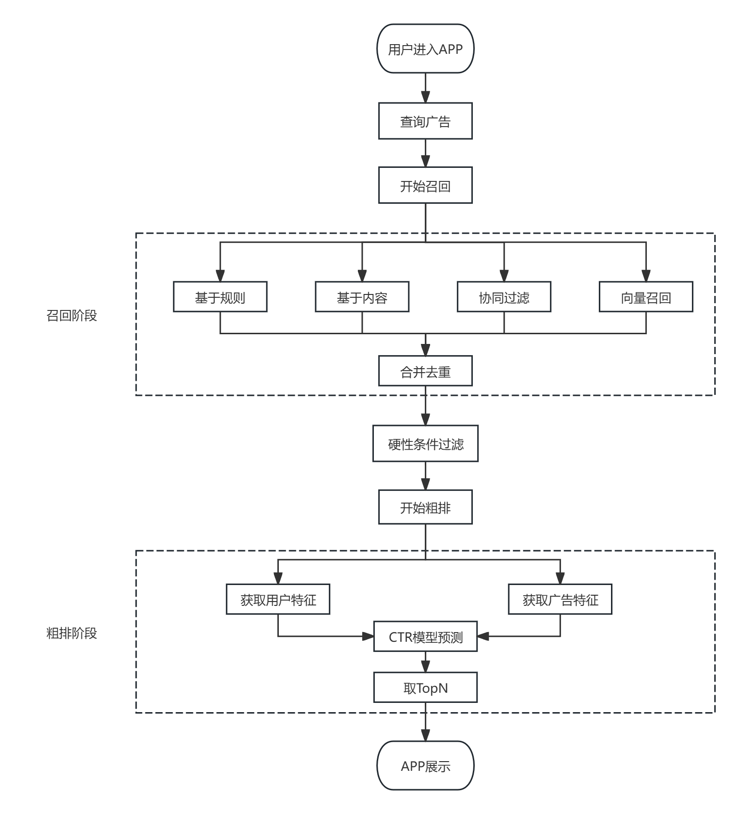
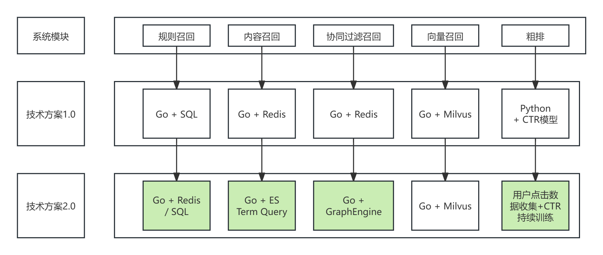
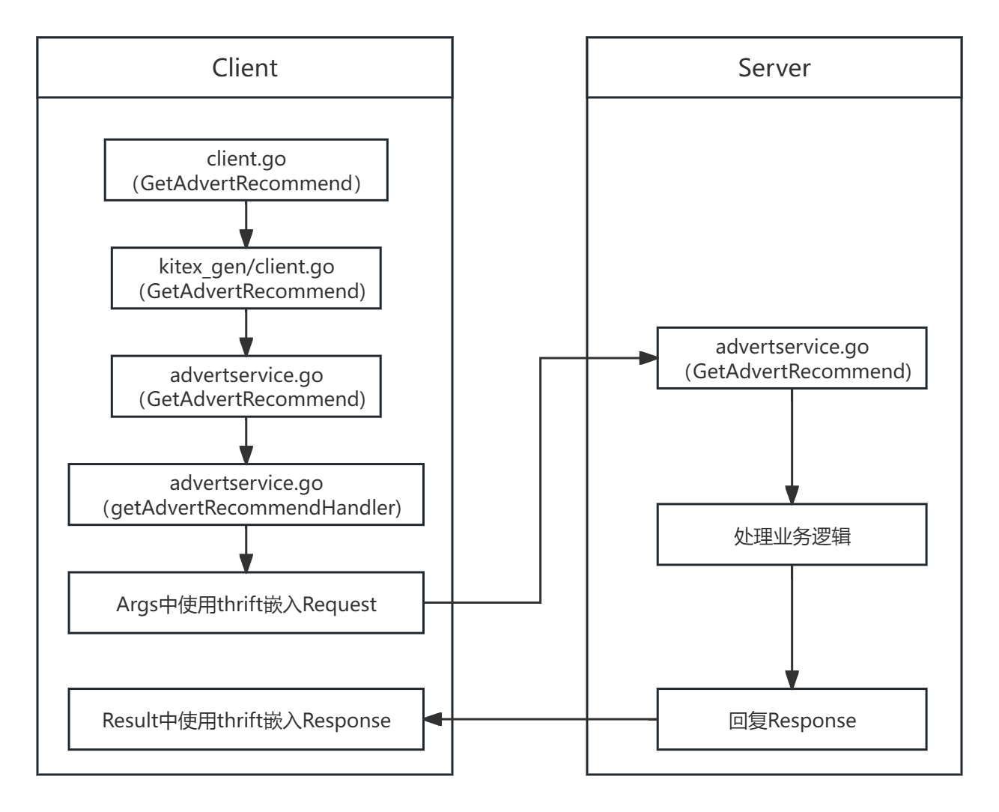

# AdvertRecommend - 广告推荐系统

基于 Go 语言开发的广告推荐系统，使用 Kitex + Thrift + GORM 框架实现。

## 技术栈

- **RPC框架**: Kitex (CloudWeGo)
- **IDL**: Thrift
- **ORM**: GORM
- **数据库**: MySQL 8.0+
- **Go版本**: 1.19

## 推荐思路
### 实现流程

### 技术方案

### 代码流程


## 项目结构

```
AdvertRecommend/
├── config/           # 配置管理
├── database/         # 数据库连接和初始化
├── handler/          # RPC 请求处理器
├── idl/              # Thrift IDL 定义文件
├── kitex_gen/        # Kitex 生成的代码
├── models/           # 数据模型（GORM）
├── service/          # 业务逻辑层
├── sql/              # SQL 初始化脚本
├── go.mod
├── go.sum
└── main.go           # 主程序入口
```

## 功能模块

### 1. 广告计划管理
- ✅ 创建广告计划
- ✅ 更新广告计划
- ✅ 查询广告计划
- ✅ 分页列表查询
- ✅ 删除广告计划

### 2. 广告创意管理
- ✅ 创建广告创意
- ✅ 更新广告创意
- ✅ 查询广告创意
- ✅ 分页列表查询（支持按计划过滤）
- ✅ 删除广告创意

### 3. 用户画像管理
- ✅ 创建用户基础画像
- ✅ 更新用户画像
- ✅ 查询用户画像
- ✅ 删除用户画像
- ✅ 添加用户兴趣标签
- ✅ 更新兴趣权重
- ✅ 查询用户兴趣列表
- ✅ 删除兴趣标签

### 4. 用户行为日志
- ✅ 记录广告事件（曝光/点击/转化）
- ✅ 查询用户行为历史
- ✅ 查询创意广告效果

## 快速开始

### 1. 环境准备

```bash
# 安装 Go 1.23+
# 安装 MySQL 8.0+
```

### 2. 数据库初始化

```bash
# 创建数据库
mysql -u root -p
CREATE DATABASE advert_recommend DEFAULT CHARACTER SET utf8mb4 COLLATE utf8mb4_unicode_ci;

# 执行初始化脚本
mysql -u root -p advert_recommend < sql/init.sql
```

### 3. 配置修改

修改 `config/config.go` 中的数据库配置：

```go
Database: DatabaseConfig{
    Host:     "localhost",
    Port:     3306,
    User:     "root",
    Password: "your_password",  // 修改为你的数据库密码
    DBName:   "advert_recommend",
    Charset:  "utf8mb4",
}
```

### 4. 安装依赖

```bash
go mod tidy
```

### 5. 运行服务

```bash
go run main.go
```

服务将在 `0.0.0.0:8888` 启动。

## API 接口说明

### 广告计划接口

#### 创建广告计划
```thrift
CreateAdPlanRequest {
    1: string name
    2: string objective          // click/download/conversion
    3: double budget
    4: string bidPrice           // CPC/CPM/CPA 格式
    5: string targetingRule      // JSON 格式定向规则
    6: string startTime          // 格式: 2024-01-01 00:00:00
    7: string endTime
}
```

#### 更新广告计划
```thrift
UpdateAdPlanRequest {
    1: i64 planId
    2: optional string name
    3: optional string objective
    4: optional double budget
    5: optional string bidPrice
    6: optional string targetingRule
    7: optional string startTime
    8: optional string endTime
    9: optional i32 status       // 1=active, 0=paused, 2=ended
}
```

#### 查询广告计划
```thrift
GetAdPlanRequest {
    1: i64 planId
}
```

#### 分页列表查询
```thrift
ListAdPlansRequest {
    1: i32 page
    2: i32 pageSize
    3: optional i32 status
}
```

### 广告创意接口

类似的 CRUD 接口，参考 `idl/advert.thrift`

### 用户画像接口

类似的 CRUD 接口，参考 `idl/advert.thrift`

### 用户行为日志接口

类似的接口，参考 `idl/advert.thrift`

## 数据库表结构

### t_ad_plan - 广告计划表
| 字段 | 类型 | 说明 |
|------|------|------|
| plan_id | BIGINT | 主键 |
| name | VARCHAR(128) | 计划名称 |
| objective | VARCHAR(64) | 投放目标 |
| budget | DECIMAL(16,2) | 总预算 |
| bid_price | VARCHAR(64) | 出价模式 |
| targeting_rule | JSON | 定向条件 |
| start_time | DATETIME | 开始时间 |
| end_time | DATETIME | 结束时间 |
| status | TINYINT | 状态 |

### t_ad_creative - 广告创意表
| 字段 | 类型 | 说明 |
|------|------|------|
| creative_id | BIGINT | 主键 |
| plan_id | BIGINT | 所属计划 |
| creative_type | TINYINT | 创意类型 |
| media_url | VARCHAR(512) | 媒体URL |
| title | VARCHAR(256) | 标题 |
| description | VARCHAR(512) | 描述 |
| status | TINYINT | 状态 |

### user_profile_base - 用户基础画像
| 字段 | 类型 | 说明 |
|------|------|------|
| user_id | BIGINT | 主键 |
| gender | TINYINT | 性别 |
| age | INT | 年龄 |
| region | VARCHAR(64) | 地域 |
| device_type | VARCHAR(64) | 设备类型 |

### user_profile_interest - 用户兴趣画像
| 字段 | 类型 | 说明 |
|------|------|------|
| id | BIGINT | 主键 |
| user_id | BIGINT | 用户ID |
| tag | VARCHAR(128) | 兴趣标签 |
| weight | DECIMAL(5,4) | 权重 0~1 |

### user_ad_event_log - 用户行为日志
| 字段 | 类型 | 说明 |
|------|------|------|
| event_id | BIGINT | 主键 |
| user_id | BIGINT | 用户ID |
| creative_id | BIGINT | 创意ID |
| event_type | TINYINT | 事件类型 |
| ts | DATETIME | 时间戳 |
| extra | JSON | 扩展信息 |

## 开发指南

### 重新生成 Kitex 代码

如果修改了 IDL 文件，需要重新生成代码：

```bash
kitex -module AdvertRecommend -service advertservice idl/advert.thrift
```

### 添加新的接口

1. 在 `idl/advert.thrift` 中定义新的接口
2. 重新生成 Kitex 代码
3. 在 `service/` 中实现业务逻辑
4. 在 `handler/` 中实现 RPC 处理器
5. 在 `main.go` 中注册新的方法处理器

## 性能优化建议

1. **数据库索引**: 已为常用查询字段添加索引
2. **连接池配置**: 可根据负载调整数据库连接池参数
3. **缓存层**: 可考虑添加 Redis 缓存热点数据
4. **分库分表**: 用户行为日志表可考虑按时间分表

## 注意事项

1. 生产环境建议关闭自动迁移，手动管理数据库表结构
2. 敏感配置（如数据库密码）建议使用环境变量或配置中心
3. 建议添加认证和授权机制
4. 建议添加限流和熔断保护
5. 建议完善日志和监控

# 快速开始指南

## 1. 环境准备

### 安装 Go
确保安装了 Go 1.19，其他版本是否有BUG不清楚，亲测1.23运行不了：
```bash
go version
```

### 安装 MySQL
确保 MySQL 8.0+ 已安装并运行：
```bash
mysql --version
```

## 2. 数据库初始化

### 创建数据库
```bash
mysql -u root -p
```

在 MySQL 命令行中执行：
```sql
CREATE DATABASE advert_recommend DEFAULT CHARACTER SET utf8mb4 COLLATE utf8mb4_unicode_ci;
USE advert_recommend;
```

### 导入表结构和测试数据
```bash
mysql -u root -p advert_recommend < sql/init.sql
```

## 3. 配置修改

编辑 `config/config.go` 文件，修改数据库连接信息：

```go
Database: DatabaseConfig{
    Host:     "localhost",
    Port:     3306,
    User:     "root",
    Password: "your_password",  // 修改这里
    DBName:   "advert_recommend",
    Charset:  "utf8mb4",
}
```

## 4. 安装依赖

在项目根目录执行：
```bash
go mod tidy
```

## 5. 启动服务

```bash
go run main.go
```

如果看到以下输出，说明服务启动成功：
```
Starting AdvertRecommend Service...
Database connected successfully
Server listening on 0.0.0.0:8888
```

## 6. 测试服务

### 方式一：使用 Kitex 客户端（推荐）

首先生成客户端代码：
```bash
kitex -module AdvertRecommend -type thrift idl/advert.thrift
```

然后参考 `example/client_example.go` 编写客户端代码。

### 方式二：使用数据库直接验证

连接数据库，检查是否可以查询到测试数据：
```sql
USE advert_recommend;

-- 查看广告计划
SELECT * FROM t_ad_plan;

-- 查看广告创意
SELECT * FROM t_ad_creative;

-- 查看用户画像
SELECT * FROM user_profile_base;

-- 查看用户兴趣
SELECT * FROM user_profile_interest;

-- 查看行为日志
SELECT * FROM user_ad_event_log;
```

## 7. API 接口测试示例

### 创建广告计划
```go
req := &recommend.CreateAdPlanRequest{
    Name:          "春季促销计划",
    Objective:     "click",
    Budget:        20000.00,
    BidPrice:      "CPC:0.8",
    TargetingRule: `{"region":["北京","上海","深圳"],"age":[20,40],"gender":[1,2]}`,
    StartTime:     "2024-03-01 00:00:00",
    EndTime:       "2024-05-31 23:59:59",
}
resp, err := client.CreateAdPlan(ctx, req)
```

### 查询广告计划
```go
req := &recommend.GetAdPlanRequest{
    PlanId: 1,
}
resp, err := client.GetAdPlan(ctx, req)
```

### 分页查询广告计划列表
```go
req := &recommend.ListAdPlansRequest{
    Page:     1,
    PageSize: 10,
}
resp, err := client.ListAdPlans(ctx, req)
```

### 更新广告计划状态
```go
status := int32(0)  // 暂停
req := &recommend.UpdateAdPlanRequest{
    PlanId: 1,
    Status: &status,
}
resp, err := client.UpdateAdPlan(ctx, req)
```

### 创建广告创意
```go
req := &recommend.CreateAdCreativeRequest{
    PlanId:       1,
    CreativeType: 1,  // 1=image, 2=video, 3=text
    MediaUrl:     "https://cdn.example.com/spring-sale.jpg",
    Title:        "春季大促销",
    Description:  "全场商品5-8折优惠",
}
resp, err := client.CreateAdCreative(ctx, req)
```

### 创建用户画像
```go
req := &recommend.CreateUserProfileRequest{
    UserId:     2001,
    Gender:     1,  // 1=male, 2=female
    Age:        30,
    Region:     "北京",
    DeviceType: "iPhone 15 Pro",
}
resp, err := client.CreateUserProfile(ctx, req)
```

### 添加用户兴趣标签
```go
req := &recommend.AddUserInterestRequest{
    UserId: 2001,
    Tag:    "数码产品",
    Weight: 0.90,
}
resp, err := client.AddUserInterest(ctx, req)
```

### 记录广告事件
```go
req := &recommend.CreateAdEventRequest{
    UserId:     2001,
    CreativeId: 1,
    EventType:  1,  // 1=exposure, 2=click, 3=conversion
    Ts:         "2024-03-15 14:30:00",
    Extra:      `{"source":"feed","position":2,"score":0.88}`,
}
resp, err := client.CreateAdEvent(ctx, req)
```

### 查询用户行为历史
```go
req := &recommend.GetUserAdEventsRequest{
    UserId:   2001,
    Page:     1,
    PageSize: 20,
}
resp, err := client.GetUserAdEvents(ctx, req)
```

## 8. 常见问题

### Q1: 数据库连接失败
**错误**: `Failed to connect database: dial tcp 127.0.0.1:3306: connect: connection refused`

**解决方案**:
1. 确认 MySQL 服务已启动
2. 检查配置中的数据库地址和端口是否正确
3. 确认数据库用户名和密码是否正确

### Q2: 表不存在
**错误**: `Table 'advert_recommend.t_ad_plan' doesn't exist`

**解决方案**:
1. 执行 SQL 初始化脚本：`mysql -u root -p advert_recommend < sql/init.sql`
2. 或者在代码中启用自动迁移（开发环境）：取消 `main.go` 中 `database.AutoMigrate()` 的注释

### Q3: 依赖包下载失败
**错误**: `go: downloading ... timeout`

**解决方案**:
```bash
# 配置 Go 代理
go env -w GOPROXY=https://goproxy.cn,direct
go mod tidy
```

### Q4: 端口被占用
**错误**: `bind: address already in use`

**解决方案**:
1. 修改 `config/config.go` 中的端口号
2. 或者关闭占用 8888 端口的进程

### Q5: 数据库密码正确缺提示拒接连接
**错误**: `[error] failed to initialize database, got error Error 1045 (28000): Access denied for user 'root'@'localhost' (using password: YES) 2025/10/29 12:02:34 Failed to initialize database: failed to connect database: Error 1045 (28000): Access denied for user 'root'@'localhost' (using password: YES)`

**解决方案**:
```sql
ALTER USER 'root'@'localhost' IDENTIFIED WITH mysql_native_password BY 'your_password';
FLUSH PRIVILEGES;
```

## 9. 生产环境部署

### 编译可执行文件
```bash
# Linux
GOOS=linux GOARCH=amd64 go build -o advertservice main.go

# Windows
GOOS=windows GOARCH=amd64 go build -o advertservice.exe main.go

# macOS
GOOS=darwin GOARCH=amd64 go build -o advertservice main.go
```

### 使用 systemd 管理服务（Linux）
创建服务文件 `/etc/systemd/system/advertservice.service`：
```ini
[Unit]
Description=Advert Recommend Service
After=network.target mysql.service

[Service]
Type=simple
User=your_user
WorkingDirectory=/path/to/AdvertRecommend
ExecStart=/path/to/AdvertRecommend/advertservice
Restart=always
RestartSec=5

[Install]
WantedBy=multi-user.target
```

启动服务：
```bash
sudo systemctl daemon-reload
sudo systemctl start advertservice
sudo systemctl enable advertservice
sudo systemctl status advertservice
```

### Docker 部署（可选）
创建 `Dockerfile`：
```dockerfile
FROM golang:1.23-alpine AS builder
WORKDIR /app
COPY . .
RUN go mod download
RUN go build -o advertservice main.go

FROM alpine:latest
RUN apk --no-cache add ca-certificates
WORKDIR /root/
COPY --from=builder /app/advertservice .
EXPOSE 8888
CMD ["./advertservice"]
```

构建和运行：
```bash
docker build -t advertservice:latest .
docker run -d -p 8888:8888 --name advertservice advertservice:latest
```

## 10. 性能优化建议

1. **数据库索引**: 已为常用查询字段添加索引，根据实际查询模式调整
2. **连接池配置**: 根据并发量调整数据库连接池参数
3. **缓存层**: 可添加 Redis 缓存热点数据
4. **分库分表**: 用户行为日志表建议按时间分表
5. **读写分离**: 配置 MySQL 主从复制，读写分离

## 11. 监控和日志

建议添加：
- Prometheus 指标采集
- Grafana 可视化监控
- ELK 日志收集和分析
- Jaeger 链路追踪

## 12. 下一步开发

- [ ] 实现推荐算法逻辑
- [ ] 添加缓存层（Redis）
- [ ] 实现实时竞价逻辑
- [ ] 添加 AB 测试功能
- [ ] 实现广告效果分析
- [ ] 添加监控和告警

## 需要帮助？

查看完整文档：`README.md`
查看示例代码：`example/client_example.go`
查看数据库表结构：`sql/init.sql`


## TODO

- [ ] 添加单元测试
- [ ] 添加集成测试
- [ ] 添加 Docker 支持
- [ ] 添加配置文件支持（YAML/JSON）
- [ ] 添加日志框架
- [ ] 添加监控和追踪
- [ ] 添加限流中间件
- [ ] 实现推荐算法逻辑

## License

MIT
